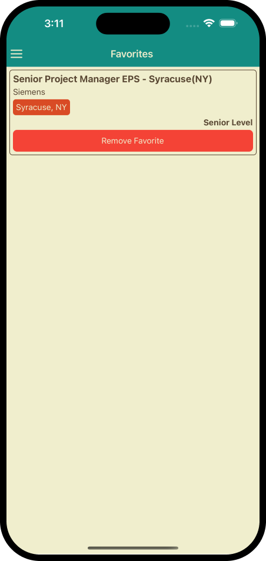

# Job Finding 🔎

This exercise was created by using following tools:

- [React Native](https://reactnative.dev/)
- [Redux Toolkit](https://redux.js.org/)
- [React Navigation (drawer & stack)](https://reactnavigation.org/)
- [Axios](https://axios-http.com/docs/intro)

- [The muse API](https://www.themuse.com/developers/api/v2)
- [Render html](https://www.npmjs.com/package/react-native-render-html)

### Demo

### Screenshots

       
